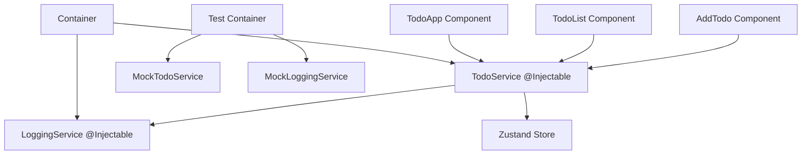

# React Todo App Architecture

## Overview

A comprehensive React/TypeScript/Webpack todo application showcasing dependency injection with InversifyJS and Zustand state management, designed for maximum testability and maintainability.

## Architecture Principles

1. **Dependency Injection First**: All services use `@Injectable` decorators
2. **Service Layer Pattern**: Components only inject and use services, never directly access stores
3. **Zustand for State Management**: Single source of truth for todo state
4. **Test-Driven IOC**: Mock implementations through container swapping in tests
5. **Colocated Testing**: Tests live alongside the units they test

## Project Structure

```
src/
├── types/
│   ├── Todo.ts                    # Core todo interface
│   ├── container.ts               # DI container types
│   └── index.ts
├── services/
│   ├── LoggingService.ts          # @Injectable logging service
│   ├── LoggingService.test.ts     # Logging service tests
│   ├── TodoService.ts             # @Injectable todo business logic
│   ├── TodoService.test.ts        # Todo service tests
│   └── index.ts
├── store/
│   ├── todoStore.ts               # Zustand store
│   ├── todoStore.test.ts          # Store tests
│   └── index.ts
├── container/
│   ├── container.ts               # Main DI container
│   ├── container.test.ts          # Container tests
│   ├── types.ts                   # Service identifiers
│   └── index.ts
├── components/
│   ├── TodoApp.tsx                # Main app component (injected)
│   ├── TodoApp.test.tsx           # Main app tests
│   ├── TodoList.tsx               # Todo list component (injected)
│   ├── TodoList.test.tsx          # Todo list tests
│   ├── TodoItem.tsx               # Todo item component (injected)
│   ├── TodoItem.test.tsx          # Todo item tests
│   ├── AddTodo.tsx                # Add todo component (injected)
│   ├── AddTodo.test.tsx           # Add todo tests
│   └── index.ts
├── hooks/
│   ├── useContainer.tsx           # Hook for DI container access
│   ├── useContainer.test.tsx      # Hook tests
│   └── index.ts
├── test-utils/
│   ├── test-container.ts          # Test container utility
│   ├── test-container.test.ts     # Test container tests
│   ├── MockTodoService.ts         # Mock implementation
│   ├── MockLoggingService.ts      # Mock implementation
│   └── index.ts
├── App.tsx                        # Root app with container provider
├── App.test.tsx                   # App integration tests
├── index.tsx                      # Entry point
└── setupTests.ts                  # Test configuration
```

## Technology Stack & Versions

- **React**: ^18.2.0 (latest stable)
- **TypeScript**: ^5.3.0 (latest)
- **Webpack**: ^5.89.0 (latest)
- **InversifyJS**: ^6.0.2 (latest)
- **Zustand**: ^4.4.7 (latest)
- **Jest**: ^29.7.0 (latest)
- **React Testing Library**: ^14.1.2 (latest)

## Dependency Injection Architecture



## Service Layer Design

### ITodoService Interface

```typescript
interface ITodoService {
  getTodos(): Todo[];
  addTodo(text: string): void;
  toggleTodo(id: string): void;
  removeTodo(id: string): void;
  subscribe(callback: (todos: Todo[]) => void): () => void;
}
```

### ILoggingService Interface

```typescript
interface ILoggingService {
  info(message: string, data?: any): void;
  warn(message: string, data?: any): void;
  error(message: string, error?: Error): void;
}
```

## Testing Strategy

### IOC Testing Pattern

```typescript
// Test utility exposes test container
const testContainer = createTestContainer();
testContainer.bind<ITodoService>(TYPES.TodoService).to(MockTodoService);

// Tests showcase IOC power
describe("TodoApp with Mock Service", () => {
  it("should interact with mock service", () => {
    const mockService = testContainer.get<ITodoService>(TYPES.TodoService);
    // Test with controlled mock behavior
  });
});
```

### Test Colocation Benefits

- **Easier Maintenance**: Tests are right next to the code they test
- **Better Discoverability**: No hunting for test files
- **Consistent Naming**: `*.test.ts` pattern throughout
- **Import Simplicity**: Relative imports are shorter

## Key Features

1. **Proper Separation of Concerns**: Components → Services → Store
2. **Full TypeScript Support**: Strict typing throughout
3. **Hot Module Replacement**: Webpack dev server with HMR
4. **Comprehensive Testing**: Unit, integration, and IOC tests colocated with source
5. **Mock-Friendly Architecture**: Easy service swapping for tests
6. **Production Ready**: Optimized webpack build configuration

## Data Flow

1. **User Interaction** → Component (with injected TodoService)
2. **Component** → TodoService.method()
3. **TodoService** → Zustand Store mutation
4. **Store Change** → Component re-render via subscription
5. **All Actions** → LoggingService for audit trail

## Development Experience

- **TypeScript IntelliSense**: Full type safety and autocompletion
- **Hot Reload**: Instant feedback during development
- **Test-Driven Development**: Easy mock injection for isolated testing
- **Debugging**: Clear service boundaries for troubleshooting
- **Colocated Tests**: Tests are always close to the code they verify

## Build Configuration

### Development

- Webpack dev server with HMR
- Source maps for debugging
- TypeScript compilation with strict mode
- ESLint integration

### Production

- Optimized bundles with code splitting
- Minification and compression
- Tree shaking for smaller bundle size
- Asset optimization

## Testing Architecture

### Unit Tests

Each service, component, and utility has its own test file colocated with the implementation, focusing on isolated functionality with mocked dependencies.

### Integration Tests

App-level tests that verify the interaction between components and services using the real DI container.

### IOC Tests

Specialized tests that demonstrate the power of dependency injection by swapping implementations through the test container.

This architecture provides a solid foundation for a scalable, testable, and maintainable todo application that showcases the power of dependency injection in React applications.
